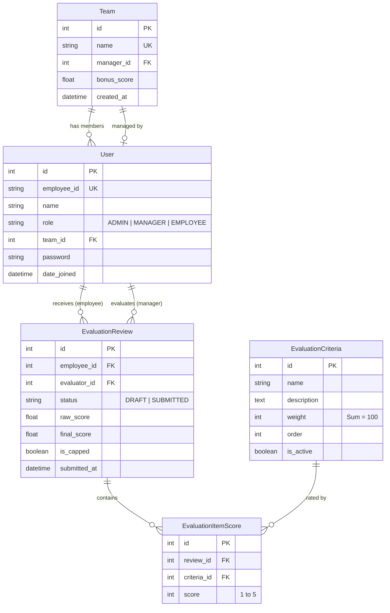

# 02. 데이터베이스 스키마 및 ERD 명세 (Database Schema & ERD)

## 1. ERD (Entity Relationship Diagram)

## 2. 테이블 상세 명세
1. **`organizations_team`**: 부서/팀 정보 및 팀 보너스 점수 저장.
2. **`authentication_user`**: Custom User 테이블 (`employee_id` 사번 PK 대체).
3. **`evaluations_evaluationcriteria`**: 평가 항목 및 가중치(합계 100) 저장.
4. **`evaluations_evaluationreview`**: 직원별 매니저 평가서 메타데이터, 개인점수, 최종점수, 제출 상태.
5. **`evaluations_evaluationitemscore`**: 평가서 내 개별 항목별 1~5점 척도 점수.

